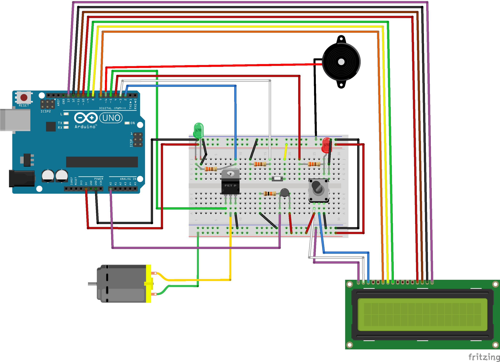

# **Infusion Pump**
###
#### Harvey Kyllonen
---

## Summary
>My infusion pump project for the Introduction to Engineering class with Professor Krupczak.
>This is a project we were required to complete in our own time in the Hope College ENGS-100 class.
>We were tasked with creating a working infusion pump using our new skills we had learned prior to this project.

>*This documentation was NOT required for the assignment.*

## Features

- Pump runs for 5 seconds, and is off for 20 seconds, this process repeats
- The user is able to activate the pump using a push button
- Green LED is ON when pump is active
- Red LED is ON when pump is IDLE
- Temperature is taken using a Thermistor
- Buzzer activates and pump turns OFF if the patients temp exceeds 80 degrees fahrenheit
- LCD screen displays patients temperature. It also displays a warning when the temperature exceeds 80 degrees fahrenheit


## Tech

Infusion Pump Components:

- [Arduino Uno] - Arduino Uno microcontroller
- [Arduino IDE] - Arduino IDE, edit and upload your code to the microcontroller
- LEDs - Two LEDs, one red one green
- Jumper Cables - Multiple male to male jumper cables
- Push button - a pushbutton for user input.
- DC Motor - A direct current motor, this is necessary for the pump
- 330 Ohm Resistors - Used for LEDs and the push button
- MOSFET Transistor - This is connected to our motor
- Thermistor - takes the patient's temperature
- 10k Ohm Resistor - Used for the Thermistor
- Buzzer - Plays a high frequency tone notifying nearby operators
- Liquid-crystal display (LCD) - Displays temperature readings and warnings


## Installation

The following diagram was made with [Fritzing]:




## Software

Line 12

Import and define the LCD screen

Initializing integer pin values and associated variables
```sh
#include <LiquidCrystal.h>

LiquidCrystal lcd(7,8,9,10,11,12,13);

int greenLED = 2; // green LED set to pin 2
int redLED = 4; // red LED set to pin 4
int button = 3; // button set to pin 3
int motor = 5; // motor set to pin 6
int buttonInput = 0; // buttonInput set to 0 meaning not pressed

int buzzer = 6; // buzzer set to pin 6
int thermPin = A0; // thermal input A0 pin
int thermValue = 0; // thermal value initialized to 0

static bool pressedStatus;
```

###
Line 32

Setup function

Setting pins to proper INPUT or OUTPUT value

Starting up the LCD display
```sh
void setup() {
  pinMode(greenLED,OUTPUT);
  pinMode(redLED,OUTPUT);
  pinMode(button,INPUT);
  pinMode(thermPin,INPUT);
  pinMode(buzzer,OUTPUT);
  Serial.begin(9600);
  Serial.println("Program Reset"); 
  
  lcd.begin(20,4);               // name.begin(cols,rows) is the code that gives the dimensions of the LCD 
  lcd.clear();		    //Has the LCD blank the screen
  lcd.setCursor(0,1);	  //set cursor to column 0, row 2
  lcd.print("Program Reset");
}
```

###
Line 51

Loop the pumpMain() function

Clear the display and print the patient's temp to it.
```sh
void loop() {
  pumpMain();

  lcd.clear(); // clear screen
  lcd.setCursor(0,1);	  //set cursor to column 0, row 2
  lcd.print("Temp:" + String(thermOutput())); // print temp to screen
  Serial.print("Temp:" + String(thermOutput())); // print temp to serial monitor
}
```

###
Line 68

The pumpMain() function

Turns the pump on and off using the appropriate functions

Delay is in milliseconds

If the temperature exceeds 80 degrees fahrenheit, play the buzzer, display a warning, and disable the pump
```sh
void pumpMain(){
  if(isPressed()==true){
    pumpOn();
    delay(5000); // wait for 5 seconds with motor ON
    pumpOff();

    if(thermOutput()>=80){
      pressedStatus = false; // set pressed to false
      lcd.clear(); // clear screen
      lcd.setCursor(0,1);	  //set cursor to column 0, row 2
      lcd.print("EMERGENCY SHUTDOWN: TEMP EXCEEDED 80"); // print to screen
      Serial.println("EMERGENCY SHUTDOWN: TEMP EXCEEDED 80"); // print warning to user
      tone(buzzer,1000,1000); // play buzzer tone for 1 second
      pumpOff(); // disable pump
    }

    delay(20000); // Wait 20 seconds
    lcd.clear(); // clear screen
  }
  else{
    pumpOff(); // disable pump
  }
}
```

###
Line 98

Turns the motor ON, as well as the green LED.
The red LED is turned OFF

```sh
void pumpOn(){
  Serial.println("Motor on");
  analogWrite(motor,255); // turn motor to max speed
  digitalWrite(greenLED,HIGH); // green LED ON
  digitalWrite(redLED,LOW);// red LED OFF
}
```

###

Line 111

Turns the motor OFF, and the green LED OFF
The red LED is set to ON
```sh
void pumpOff(){
  Serial.println("Motor off");
  analogWrite(motor,0); // Turn motor OFF
  digitalWrite(greenLED,LOW); // turn green LED OFF
  digitalWrite(redLED,HIGH); // turn red LED ON
}
```

###
Line 125

Check if the button is pressed
This function is of type bool, it will return a bool (True/False)
```sh
bool isPressed(){
  static bool pressedStatus;
  buttonInput = digitalRead(button); //. read button input
  
  if(buttonInput == 1 && pressedStatus == true){ // if button pressed and its already been pressed before
    Serial.println("pressed to false");
    pressedStatus = false; // set pressed to false
    return pressedStatus;
  }
  else if(buttonInput == 1 && pressedStatus == false){ // If button pressed
    Serial.println("pressed to true");
    pressedStatus = true; // set pressed to true
    return pressedStatus;
  }
  return pressedStatus;
}
```

###
Line 148

This function reads the temperature value from the thermistor, and converts the temp into fahrenheit.

This function returns a float which is the temp reading in fahrenheit
```sh
float thermOutput(){
  thermValue=analogRead(thermPin);

  int R25 = 10000; //Ohms
	float a1 = 3.354016E-3;
	float b1 = 2.56985E-4;
	float c1 = 2.620131E-6;
	float d1 = 6.383091E-8;

  float voltage = float(thermValue)*(5000.0/1024.0); //units are milivolts
  float Rdivider = 10000; //Resistance in Ohms of the other resistor.
  float Rtherm = Rdivider*((5000.0/voltage) -1); //Voltage divider equation
	
  //Thermistor resistance-to-temperature conversion equation (from datasheet)
	float Tkelvin = 1/(a1 + b1*log(Rtherm/R25) \
		+ c1*log(Rtherm/R25)*log(Rtherm/R25) \
		+ d1*log(Rtherm/R25)*log(Rtherm/R25)*log(Rtherm/R25));

  //Temperature conversions
	float Tcelsius = Tkelvin - 273.15;
	float Tfahren = (Tcelsius*(9.0/5.0))+32.0;

  return Tfahren; // return fahrenheit
}
```

[//]: # (These are reference links used in the body of this note and get stripped out when the markdown processor does its job. There is no need to format nicely because it shouldn't be seen. Thanks SO - http://stackoverflow.com/questions/4823468/store-comments-in-markdown-syntax)
   [Arduino IDE]: <https://www.arduino.cc/en/software>
   [Arduino Uno]: <https://store.arduino.cc/products/arduino-uno-rev3>
   [Fritzing]: <https://fritzing.org/>