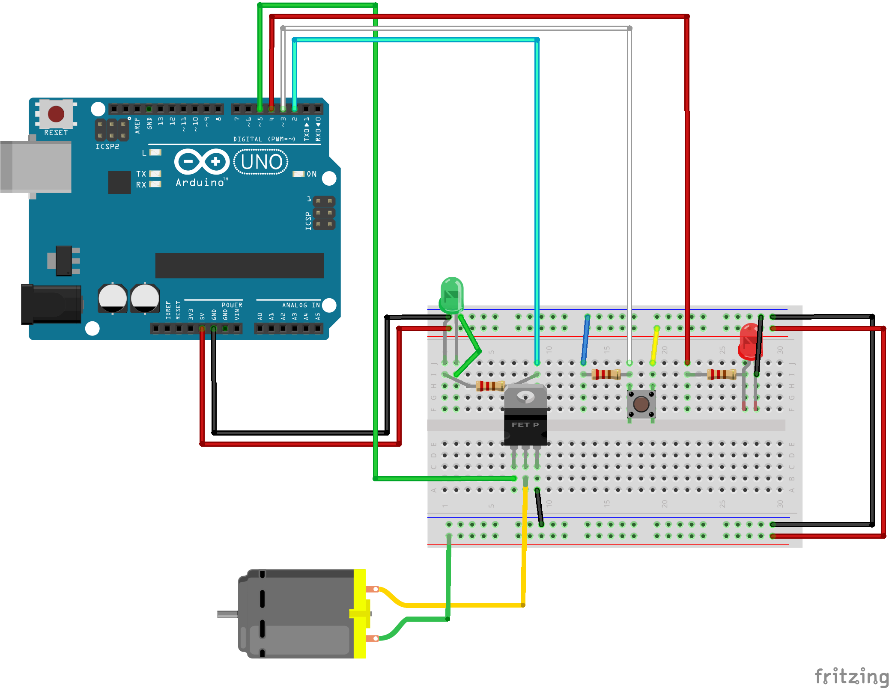

# **Infusion Pump**
###
#### Harvey Kyllonen
---

## Summary
>My infusion pump project for the Introduction to Engineering class with Professor Krupczak.
>This is a project we were required to complete in our own time in the Hope College ENGS-100 class.
>We were tasked with creating a working infusion pump using our new skills we had learned prior to this project.

>*This documentation was NOT required for the assignment.*

## Features

- Pump runs for 5 seconds, and is off for 20 seconds, this process repeats
- The user is able to activate the pump using a button
- Green LED is ON when pump is active
- Red LED is ON when pump is IDLE


## Tech

Infusion Pump Components:

- [Arduino Uno] - Arduino Uno microcontroller
- [Arduino IDE] - Arduino IDE, edit and upload your code to the microcontroller
- LEDs - Two LEDs, one red one green
- Jumper Cables - Multiple male to male jumper cables
- Push button - a pushbutton for user input.
- DC Motor - A direct current motor, this is necessary for the pump
- 330 Ohm Resistors - Used for LEDs and the push button
- MOSFET Transistor - This is connected to our motor


## Installation

The following diagram was made with [Fritzing]:




## Software

Line 11

Initializing integer pin values
```sh
int greenLED = 2; // green LED set to digital pin 2
int redLED = 4; // red LED set to digital pin 4
int button = 3; // push button set to digital pin 3
int motor = 5; // motor set to digital pin 6
int buttonInput = 0; // buttonInput set to 0 meaning not pressed
```

###
Line 22

Setup function

Setting pins to proper INPUT or OUTPUT value
```sh
void setup() {
  pinMode(greenLED,OUTPUT);
  pinMode(redLED,OUTPUT);
  pinMode(button,INPUT);
  Serial.begin(9600);
  Serial.println("Program Reset"); 
}
```

###
Line 34
Loop the pumpMain() function

```sh
void loop() {
  pumpMain();
}
```

###
Line 46
The pumpMain() function
Turns the pump on and off using the appropriate functions
Delay is in milliseconds.

```sh
void pumpMain(){
  if(isPressed()==true){
    pumpOn();
    delay(5000); // wait for 5 seconds with motor ON
    pumpOff();
    delay(20000); // Wait 20 seconds
  }
  else{
    pumpOff();
  }
}
```

###
Line 64
Turns the motor ON, as well as the green LED.
The red LED is turned OFF

```sh
void pumpOn(){
  Serial.println("Motor on");
  analogWrite(motor,255); // turn motor to max speed
  digitalWrite(greenLED,HIGH); // green LED ON
  digitalWrite(redLED,LOW);// red LED OFF
}
```

###

Line 77
Turns the motor OFF, and the green LED OFF
The red LED is set to ON
```sh
void pumpOff(){
  Serial.println("Motor off");
  analogWrite(motor,0); // Turn motor OFF
  digitalWrite(greenLED,LOW); // turn green LED OFF
  digitalWrite(redLED,HIGH); // turn red LED ON
}
```

###
Line 91
Check if the button is pressed
This function is of type bool, it will return a bool (True/False)
```sh
bool isPressed(){
  static bool pressedStatus;
  buttonInput = digitalRead(button); //. read button input
  
  if(buttonInput == 1 && pressedStatus == true){ // if button pressed and its already been pressed before
    Serial.println("pressed to false");
    pressedStatus = false; // set pressed to false
    return pressedStatus;
  }
  else if(buttonInput == 1 && pressedStatus == false){ // If button pressed
    Serial.println("pressed to true");
    pressedStatus = true; // set pressed to true
    return pressedStatus;
  }
  return pressedStatus;
}
```

[//]: # (These are reference links used in the body of this note and get stripped out when the markdown processor does its job. There is no need to format nicely because it shouldn't be seen. Thanks SO - http://stackoverflow.com/questions/4823468/store-comments-in-markdown-syntax)
   [Arduino IDE]: <https://www.arduino.cc/en/software>
   [Arduino Uno]: <https://store.arduino.cc/products/arduino-uno-rev3>
   [Fritzing]: <https://fritzing.org/>